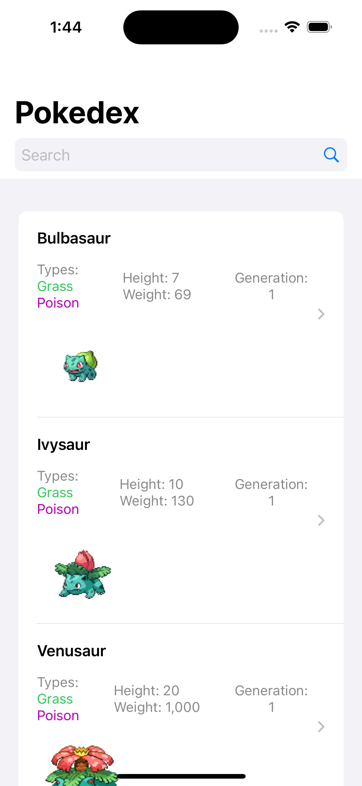
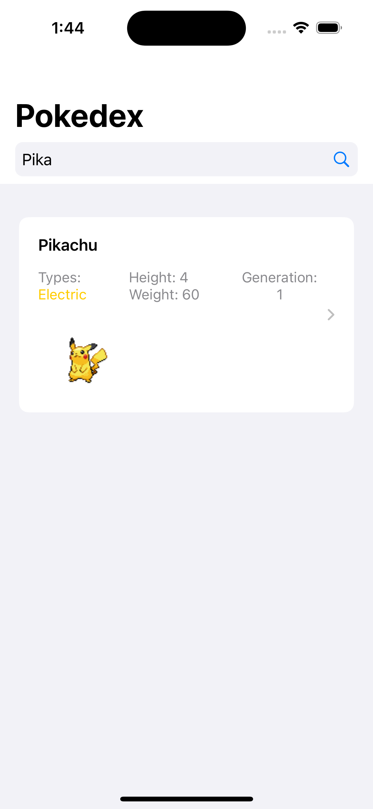
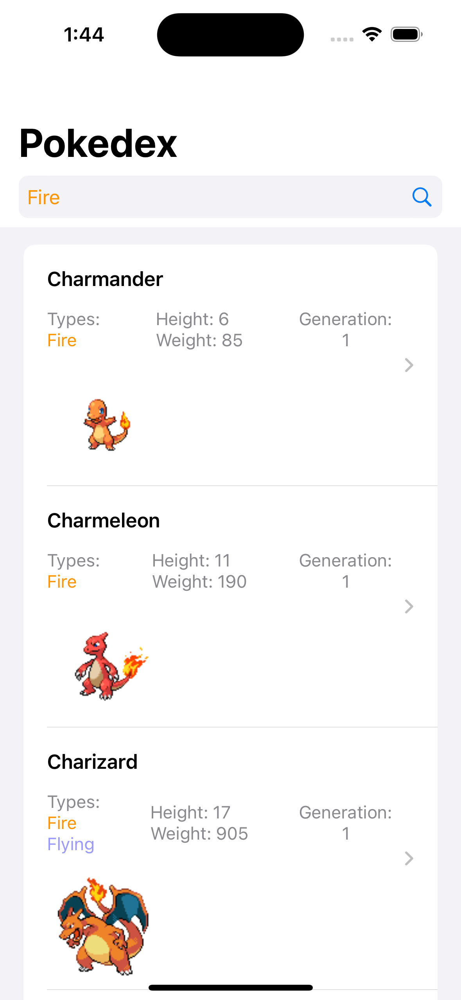
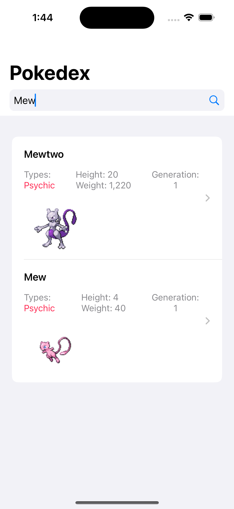
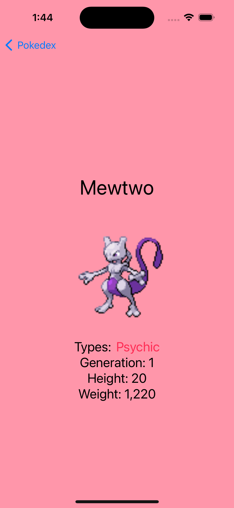
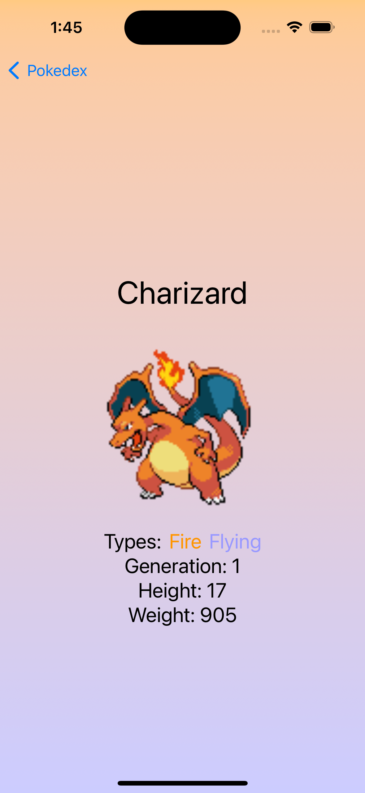

# Pokepedia-App
A simple native iOS app with SwiftUI of a pokedex of 1st gen pokemon featuring list rendering, drilldown navigation, search, Rest API communication and caching responses and smooth transitions.

  

  

  

  

  

